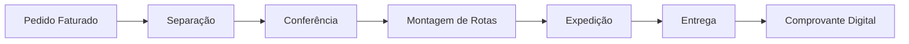

<div align="center">

# 🚚 Sistema Logística Inteligente

### Plataforma completa de gestão de expedição para distribuidoras

[](https://www.typescriptlang.org/)
[](https://nextjs.org/)
[](https://nodejs.org/)
[](https://supabase.com/)
[](https://tailwindcss.com/)

[Funcionalidades](#-funcionalidades) • [Tecnologias](#-tecnologias) • [Instalação](#-instalação) • [Uso](#-uso) • [API](#-api-endpoints) • [Roadmap](#-roadmap)

</div>

---

## 📋 Sobre o Projeto

O **Sistema Logística Inteligente** é uma solução completa e moderna para gestão de expedição em distribuidoras. Automatiza todo o fluxo desde o faturamento até a entrega final, incluindo separação de pedidos, roteirização inteligente, rastreamento em tempo real e comprovante digital de entrega.

### 🎯 Problema que Resolve

- ❌ Gestão manual e desorganizada de expedições
- ❌ Falta de rastreabilidade dos pedidos
- ❌ Perda de comprovantes físicos de entrega
- ❌ Dificuldade em otimizar rotas de entrega
- ❌ Ausência de métricas e indicadores de desempenho

### ✅ Benefícios

- ✨ **Rastreabilidade completa** - Acompanhe cada pedido em tempo real
- 📊 **Dashboard inteligente** - KPIs e métricas atualizadas
- 🗺️ **Roteirização otimizada** - Economia de combustível e tempo
- 📱 **Apps Mobile** - Separadores e motoristas com apps dedicados
- ☁️ **Comprovantes digitais** - Armazenamento seguro no Google Drive
- 🔒 **Segurança avançada** - Row Level Security (RLS) no banco de dados

---

## ✨ Funcionalidades

### 🖥️ **Web Admin**
- [x] **Dashboard em tempo real**
  - KPIs de expedição e entregas
  - Gráficos de desempenho
  - Alertas de pedidos atrasados
  
- [x] **Gestão de Pedidos**
  - Listagem com filtros avançados
  - Timeline completa do pedido
  - Detalhes de itens e status

- [x] **Separação de Pedidos**
  - Interface de separação item por item
  - Suporte a leitor de código de barras
  - Barra de progresso visual
  - Priorização automática

- [ ] **Roteirização Inteligente** *(em desenvolvimento)*
  - Montagem de rotas por região
  - Visualização em mapa
  - Otimização automática de trajetos

- [ ] **Relatórios** *(planejado)*
  - Relatórios de expedição
  - Desempenho de motoristas
  - Tempo médio de entrega
  - Exportação Excel/PDF

### 📱 **Apps Mobile** *(planejado)*
- [ ] **App Separadores**
  - Scanner de código de barras
  - Confirmação de itens
  
- [ ] **App Motoristas**
  - Rotas do dia com GPS
  - Captura de assinatura digital
  - Foto do comprovante
  - Registro de ocorrências

### 🔌 **Integrações**
- [ ] SAP Business One
- [ ] WMS Expert
- [x] Google Drive (comprovantes)

---

## 🏗️ Tecnologias

### Backend
- **Node.js 20** - Runtime JavaScript
- **Express** - Framework web minimalista
- **TypeScript** - Tipagem estática
- **Supabase** - Backend as a Service (PostgreSQL)
- **Winston** - Sistema de logs
- **Google Drive API** - Armazenamento de arquivos

### Frontend
- **Next.js 14** - Framework React com App Router
- **React 18** - Biblioteca UI
- **TypeScript** - Tipagem estática
- **Tailwind CSS** - Framework CSS utilitário
- **Zustand** - Gerenciamento de estado
- **Axios** - Cliente HTTP
- **Lucide React** - Ícones modernos

### Banco de Dados
- **PostgreSQL** (via Supabase)
- **16 tabelas** relacionadas
- **Row Level Security (RLS)**
- **Triggers e Views** otimizadas
- **Funções PL/pgSQL** customizadas

---

## 📂 Estrutura do Projeto

```
sistema-logistica/
│
├── database/                      # 📊 Scripts SQL
│   ├── schema.sql                # Tabelas principais
│   ├── views_triggers.sql        # Views e triggers
│   ├── rls_policies.sql          # Políticas de segurança
│   └── README.md
│
├── backend/                       # 🔧 API REST
│   ├── src/
│   │   ├── config/               # Configurações (Supabase, Google Drive)
│   │   ├── middlewares/          # Auth, error handler
│   │   ├── routes/               # Módulos da API
│   │   │   ├── pedidos.routes.ts
│   │   │   ├── separacao.routes.ts
│   │   │   ├── rotas.routes.ts
│   │   │   ├── entregas.routes.ts
│   │   │   ├── dashboard.routes.ts
│   │   │   ├── relatorios.routes.ts
│   │   │   ├── cadastros.routes.ts
│   │   │   └── integracao.routes.ts
│   │   ├── utils/                # Logger, helpers
│   │   └── server.ts             # Servidor principal
│   ├── .env.example
│   ├── package.json
│   └── README.md
│
└── frontend/                      # 🎨 Aplicação Web
    ├── app/                      # Páginas (Next.js App Router)
    │   ├── dashboard/
    │   ├── pedidos/
    │   ├── separacao/
    │   ├── roteirizacao/
    │   ├── entregas/
    │   ├── cadastros/
    │   ├── relatorios/
    │   └── login/
    ├── components/               # Componentes reutilizáveis
    │   ├── Sidebar.tsx
    │   ├── Header.tsx
    │   ├── Card.tsx
    │   └── StatusBadge.tsx
    ├── lib/                      # Bibliotecas e utils
    │   ├── api.ts               # Cliente axios
    │   ├── supabase.ts          # Cliente Supabase
    │   ├── store.ts             # Zustand store
    │   └── utils.ts             # Funções auxiliares
    ├── .env.example
    ├── package.json
    └── README.md
```

---

## 🚀 Instalação

### Pré-requisitos

- Node.js 20+ ([Download](https://nodejs.org/))
- Conta no Supabase ([Criar grátis](https://supabase.com/))
- Git ([Download](https://git-scm.com/))

### 1️⃣ Clone o Repositório

```bash
git clone https://github.com/octaviomemoria/sistema-logistica.git
cd sistema-logistica
```

### 2️⃣ Configure o Banco de Dados

1. Crie um projeto no [Supabase](https://supabase.com/)
2. No SQL Editor, execute os scripts na ordem:

```sql
-- 1. Criar tabelas
\i database/schema.sql

-- 2. Criar views e funções
\i database/views_triggers.sql

-- 3. Configurar segurança
\i database/rls_policies.sql
```

### 3️⃣ Configure o Backend

```bash
cd backend

# Instalar dependências
npm install

# Copiar arquivo de ambiente
cp .env.example .env

# Editar .env com suas credenciais
# - SUPABASE_URL
# - SUPABASE_ANON_KEY
# - Outras configurações (veja .env.example)
```

### 4️⃣ Configure o Frontend

```bash
cd ../frontend

# Instalar dependências
npm install

# Copiar arquivo de ambiente
cp .env.example .env

# Editar .env
# - NEXT_PUBLIC_API_URL=http://localhost:3001/api
# - NEXT_PUBLIC_SUPABASE_URL
# - NEXT_PUBLIC_SUPABASE_ANON_KEY
```

### 5️⃣ Execute o Projeto

**Terminal 1 - Backend:**
```bash
cd backend
npm run dev
# 🚀 Servidor rodando em http://localhost:3001
```

**Terminal 2 - Frontend:**
```bash
cd frontend
npm run dev
# 🎨 Aplicação rodando em http://localhost:3000
```

### 6️⃣ Acesse o Sistema

Abra seu navegador em: **http://localhost:3000**

**Credenciais padrão** (crie no Supabase Auth):
- Email: seu.email@exemplo.com
- Senha: definida por você

---

## 🎯 Uso

### Fluxo Completo de Operação



### 1. **Dashboard**
- Visualize KPIs em tempo real
- Acompanhe expedições do dia
- Identifique pedidos atrasados

### 2. **Separação**
- Acesse `/separacao`
- Selecione um pedido disponível
- Use leitor de código de barras ou confirme manualmente
- Finalize quando todos itens confirmados

### 3. **Roteirização** *(em desenvolvimento)*
- Monte rotas por região/transportadora
- Adicione pedidos à rota
- Otimize o trajeto automaticamente
- Despache para entrega

### 4. **Entregas** *(em desenvolvimento)*
- Motorista acessa app mobile
- Visualiza rotas do dia
- Registra comprovante com assinatura + foto
- Sistema atualiza status automaticamente

---

## 📡 API Endpoints

### Autenticação
Todos os endpoints requerem autenticação via JWT (Supabase Auth).

### Principais Rotas

#### **Pedidos**
```
GET    /api/pedidos              # Listar pedidos (com paginação)
GET    /api/pedidos/:id          # Detalhes do pedido
GET    /api/pedidos/:id/timeline # Timeline do pedido
PUT    /api/pedidos/:id/status   # Atualizar status
```

#### **Separação**
```
GET    /api/separacao/disponiveis              # Pedidos disponíveis
POST   /api/separacao/iniciar                  # Iniciar separação
POST   /api/separacao/:id/item                 # Confirmar item
POST   /api/separacao/:id/finalizar            # Finalizar separação
```

#### **Dashboard**
```
GET    /api/dashboard/estatisticas  # KPIs principais
GET    /api/dashboard/alertas       # Alertas e pendências
GET    /api/dashboard/grafico       # Dados para gráficos
```

#### **Rotas**
```
GET    /api/rotas                # Listar rotas
POST   /api/rotas                # Criar rota
PUT    /api/rotas/:id            # Atualizar rota
POST   /api/rotas/:id/otimizar   # Otimizar trajeto
```

Para documentação completa da API, veja: [backend/README.md](backend/README.md)

---

## 👥 Perfis de Usuário

O sistema suporta 5 perfis com permissões específicas (RLS):

| Perfil | Descrição | Permissões |
|--------|-----------|------------|
| **Admin** | Administrador total | Acesso completo |
| **Gestor** | Supervisor de operações | Gerencia pedidos, rotas, relatórios |
| **Separador** | Operador de separação | Separação de pedidos apenas |
| **Conferente** | Conferência de pedidos | Conferência e expedição |
| **Motorista** | Entregador | Visualiza rotas, registra entregas |

---

## 🗺️ Roadmap

### ✅ Fase 1 - MVP (Concluído)
- [x] Estrutura do banco de dados
- [x] Backend API REST completo
- [x] Frontend: Dashboard e Pedidos
- [x] Módulo de Separação

### 🚧 Fase 2 - Em Desenvolvimento
- [ ] Módulo de Roteirização com mapa
- [ ] Módulo de Relatórios
- [ ] Cadastros (CRUD completo)

### 📅 Fase 3 - Planejado
- [ ] App Mobile Separadores (React Native)
- [ ] App Mobile Motoristas (React Native)
- [ ] Impressão de etiquetas e romaneios
- [ ] Notificações push

### 🔮 Fase 4 - Futuro
- [ ] Integração SAP Business One
- [ ] Integração WMS Expert
- [ ] Tracking GPS em tempo real
- [ ] Otimização automática de rotas (IA)
- [ ] Dashboard para TV/monitor

---

## 🤝 Contribuindo

Contribuições são bem-vindas! Sinta-se à vontade para:

1. Fazer um fork do projeto
2. Criar uma branch para sua feature (`git checkout -b feature/nova-funcionalidade`)
3. Commit suas mudanças (`git commit -m 'feat: adiciona nova funcionalidade'`)
4. Push para a branch (`git push origin feature/nova-funcionalidade`)
5. Abrir um Pull Request

### Padrão de Commits

Use [Conventional Commits](https://www.conventionalcommits.org/):

- `feat:` - Nova funcionalidade
- `fix:` - Correção de bug
- `docs:` - Documentação
- `style:` - Formatação
- `refactor:` - Refatoração
- `test:` - Testes
- `chore:` - Manutenção

---

## 📄 Licença

Este projeto é proprietário e privado.

---

## 👨‍💻 Autor

**Octávio Memória**

- GitHub: [@octaviomemoria](https://github.com/octaviomemoria)
- Email: 121621957+octaviomemoria@users.noreply.github.com

---

## 🙏 Agradecimentos

- [Supabase](https://supabase.com/) - Backend as a Service incrível
- [Vercel](https://vercel.com/) - Deploy do frontend
- [Next.js](https://nextjs.org/) - Framework React moderno
- Comunidade open-source

---

<div align="center">

**[⬆ Voltar ao topo](#-sistema-logística-inteligente)**

Feito com ❤️ e ☕

</div>
